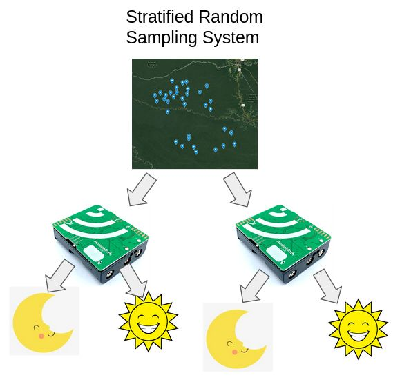

# Stratified Random Sampling System

- Write a function that will take in csv path and output a new csv file with a stratified random sample of the original csv. Should return True/False if the stratified csv file was successful.
- The CSV should have #Successful Audiomoths * 24 clips. Each clip should represent a different hour of the day.
	- Make sure the clips chosen are a minute long (successful recordings)
	- They are 46.1 megabytes for reference
- The first strata layer to be represented by each Audiomoth device.
	- Make it so that IF an Audiomoth device has enough clips, it will be added to the first strata layer.
	- Audiomoth 21, 19, 8, 28 had problems
- The second strata layer to be represented by the hours of the day.
	- The CSV is in UTC, (0-23)
	- There are a lot of approaches to this part, maybe use something like pandas to find all of the rows in the csv that are in a certain audiomoth, that are a certain hour, that are a minute long, and put those in a list. You can then randomly select a clip from that list. Then repeat for all the hours.
- In theory then we can go through that csv and copy those clips into a separate folder. What you are essentially doing is finding a representative sample of a larger dataset that is significantly smaller.
	- Should go from 4,300 gigabytes to 31*24*46.1/1000 = 34.3 gigabytes.
	- Luckily, we had someone implement a poorer version of this over the summer, so this isn’t on the critical path, this is a means for you to get familiarized with our data, get some statistics knowledge, and contribute meaningfully by optimizing some methods previously performed.